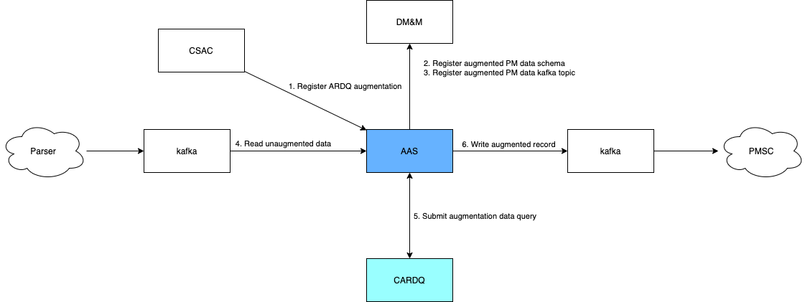

<!--Document Template information:
Prepared: Michael Gavin
Approved:
Document Name:application-developers-guide-template
Revision: {!.bob/var.application-developers-guide-version!}
Date: {!.bob/var.date!}
-->

# Assurance Augmentation Service (AAS) Application Developers Guide

[TOC]

## Introduction

This document provides guidelines for how to use the  Assurance Augmentation Service (AAS) from an application developer’s point of view.

This guide provides description of the main features and interfaces of AAS. It also provides guidance for the data flow and the required JSON
resources for Analytics Reporting Dimensioning Query (ARDQ) registration flow and augmentation flow.

### Revision History

| Date       | Revision | Comment                                                      | Author  |
|------------|----------|--------------------------------------------------------------|---------|
| 2022-04-25 | 1.0.0    | First draft                                                  | EGAVMIC |
| 2023-08-25 | 1.0.1    | Refactor ARDQ response handling to generate multiple records | EPTAMUA |

## General Concept

The primary purpose of AAS is augmenting the Performance Metrics (PM) data records generated by a PM parser with additional context data.  Augmentation data is provided by an ARDQ
service e.g., Core Analytics Reporting Dimensioning Query (CARDQ).

AAS has three main functions:
1. Handle ARDQ registration requests and generate registration notifications.
2. Receive ARDQ registration notifications and update the PM data consumer and augmentation processing flows as directed.
3. Consume and augment the PM data records. Augmented records will be written to an output Kafka topic.

### Basic Flow
As shown in the diagram below, AAS basic flow is as follows:
1. ARDQ registration submitted, including the ARDQ service URL (CARDQ), the optional ardq type (typically "ran" or "core") and the list of augmentations to apply for a given input PM data schema.
2. AAS creates the augmented PM data schema and registers it with the Data Catalog and Schema Registry in the Data Management and
   Movement (DMM) application.
3. AAS registers the output Kafka topic as the destination for augmented PM data records.
4. AAS creates the Kafka consumer and starts consuming unaugmented PM data records.
5. A data augmentation query is sent to CARDQ using input fields from the unaugmented PM data records.
6. An augmented PM data record is created using the data retrieved from CARDQ and written to the previously registered output topic.




### System Context View
The diagram below shows the AAS in context as it is deployed. In the initial deployment:

* CSAC will be the Augmentation Creator.
* CARDQ will be the Augmentation Information Provider.


### Data Flow: ARDQ Registration

#### ARDQ Registration Data Format
This is an example of the structure of a typical ARDQ registration resource:
```json
{
  "ardq_id": "cardq", // globally unique ARDQ registration identifier
  "ardq_url": "http://eric-oss-cardq:8080", // full path to target ARDQ service
  "ardq_type": "core", // for now either "core" or "ran"
  "rules": [
  {
    "input_schema": "<dataSpace>|<dataCategory>|<schemaName>", // reference for Data Catalog lookup
    "fields": [
    {
      "output": "nsi", // name of the field to add to the augmented schema
      "input": ["snssai", "moFDN"] // field names in the incoming record to use to query ARDQ
                                   // for the output field value
    }]
  }]
}
```
#### ARDQ Registration

**Data Flow 1: Create ARDQ**

1. Validate ARDQ Registration.

   a. Unique ARDQ Id <br>
   b. ARDQ Id format: no reserved characters, e.g., ^:?#][@!$&')(*+,;= <br>
   c. Well-formed ARDQ URL<br>
2. Retrieve input schema info from the Data Catalog.

3. Create augmented schema (copy of the input schema).

   a. Set schema name = output_prefix + input schema name<br>
   b. Add output fields from ARDQ rule set<br>
   c. Register schema with output prefix<br>

4. Initiate Data Augmentation Flow.


**Data Flow 2: Update ARDQ**

1. Validate ARDQ Registration.

   a. ARDQ Id must exist <br>
   b. Well-formed ARDQ URL<br>

2. Retrieve output schema info from the Data Catalog.

3. If there are new output fields

   a. Create augmented schema (copy of the retrieved schema)<br>
   - i. Add new output fields from ARDQ rule set. <br>
   - ii. Register schema with an output prefix and a new version.<br)>

4. Initiate Data Augmentation Flow.

**Data Flow 3: Delete ARDQ**

1. Validate ARDQ Id.
   - ARDQ Id must exist.
2. If there is no remaining ARDQ registrations for a given input schema, stop augmentation flow for that schema.
3. Remove ARDQ registration from persistent store.

### Data Flow: Data Augmentation Flow

The augmentation flow depends on receiving ARDQ registration notifications.  A single consumer per AAS instance will be initialized on AAS startup based on deployment configuration.

Augmentation of PM records is based on a single consumer per input Avro schema.  This may result in multiple consumer instances for a single AAS
instance for a single Kafka topic.

The data augmentation flow comprises three main elements:

* Initial startup behaviour
* Handle registration notifications
* Process data record augmentation

**Initial Deployment/Startup Behaviour**

On initial deployment, AAS will not consume any records. Consumers will be configured and enabled when associated ARDQ registrations are created.

1. Initialize database

   a. Flyway will ensure that it is only initialized once

2. Create registration notification listener

3. Start registration notification listener

**Create Registration Notification Flow**

1. Consume create registration notification

2. Retrieve the registration from the database

3. For each input schema

   a. Retrieve the output schema and output Kafka topic from the database

   b. If a consumer exists for the input schema/input topic

    * i. Stop the consumer

    * ii.  Allow any in-progress augmentation to complete

   c. Create a consumer for the input schema/topic

    * i. Get all ARDQ rules for the input schema

    * ii. Create an AugmentationProcessor for the set of augmentation rules, ARDQ URL, ARDQ type, output schema, and output topic
        * Create KafkaTemplate
    * iii. Create the consumer instance with the AugmentationProcessor

   d. Start the consumer


**Update Registration Notification Flow**

1. Consume update notification.

   a. Get list of deleted input schemas.

2. For each input schema in the deleted list,

   a. If a consumer exists for the input schema/input topic:
   - i. Stop the consumer.

   - ii. Allow any in-progress augmentation to complete.

3. Retrieve registration from the database.

4. For each input schema:

   a. Retrieve the output schema and output Kafka topic from the database.

   b. If a consumer exists for the input schema/input topic:

   * i. Stop the consumer.

   * ii. Allow any in-progress augmentation to complete.

   c. Create a consumer for the input schema/topic.

   * i. Get all ARDQ rules for the input schema.

   * ii. Create an AugmentationProcessor for the set of augmentation rules, ARDQ URL, ARDQ type, output schema, and output topic.

      - Create KafkaTemplate.

   * iii. Create the consumer instance with the AugmentationProcessor.

   d. Start the consumer.

**Delete Registration Notification Flow**

1. Consume create registration notification

   a. Get list of deleted input schemas from the notification
2. For each input schema in the deleted list:

   a. If a consumer exists for the input schema/input topic:
   * i. Stop and delete the consumer
   * ii. Allow any in-progress augmentation to complete

**Data Record Processing Flow**

1. Consume the input record

2. Process the input record (AugmentationProcessor:apply)

   a. Create empty ARDQ query resource

   b. For each field

   * i. Add output field spec to query resource

   c. Submit ARDQ query to ARDQ service

   d. Transform response into output record. For each field list in ARDQ response :
     * i. Create empty output record
       * Ensure the output schema is in header of output record
     * ii. Copy all fields from input record to output record
     * iii. For each field, add individual augmented value to the output record.
     * iv. Send message via KafkaTemplate

**Restart Data Record Processing Flow**

1. Read all ARDQ registrations from DB

2. For each input schema

   a. Retrieve the output schema and output Kafka topic from the database

   b. Create a consumer for the input schema/topic

   * i. Get all ARDQ rules for the input schema
   * ii. Create an AugmentationProcessor for the set of augmentation rules, ARDQ URL, output schema, and output topic
     * Create KafkaTemplate
   * iii. Create the consumer instance with the AugmentationProcessor

   c. Start the consumer
3. Create the registration notification listener

4. Start the registration notification listener

## Interfaces

AAS introduces a new application interface, comprising two REST API specifications:

1. IF.OSS_AIR.AUG.REG - registration API implemented by AAS. See API Documentation listed under Developer Product Information.

2. IF.OSS_AIR.AUG.DATA - data query API documented by AAS.  AAS does not implement this API: it will be
implemented by an appropriate ARDQ implementation, such as CARDQ. See ARDQ OpenAPI Spec listed under Additional Documents.


**Dependent Components**

* Data Catalog (DMM) - read/write client

* Schema Registry (DMM) - read/write client

* Kafka (DMM) - read/write client

* EDB (PostgreSQL) - read/write client

* ARDQ - read client

## References

- [Data Catalog User Guide](https://adp.ericsson.se/marketplace/data-catalog/documentation)
- [Schema Registry User Guide](https://adp.ericsson.se/marketplace/schema-registry-sr/documentation)
- [KF Operator SZ User Guide](https://adp.ericsson.se/marketplace/kf-operator-sz/documentation)
- [DMM repository](https://gerrit-gamma.gic.ericsson.se/#/admin/projects/OSS/com.ericsson.oss.dmi/eric-oss-dmm)
- [Core Analytics Reporting Dimensioning Query User Guide](https://adp.ericsson.se/marketplace/core-analytics-reporting-dimensioning-qu/documentation)
