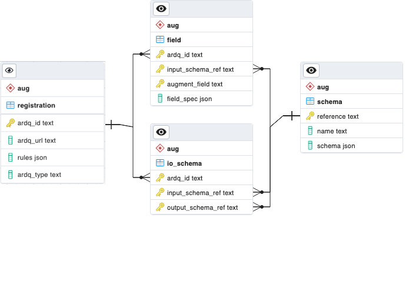

# Assurance Augmentation Database Schema

This document provides a detailed description of the database schema for the Assurance Augmentation (AAS) microservice.

## Background

The AAS microservice augments records using augmentation registration information provided by the Augmentation Creator. Registration information contains where to get augmentation information and rules for augmenting input records. The registration information will be persisted along with the related output record details.

## Schema

The AAS database is defined with one schema. The name of the schema is `aug` for augmentation information.

> NOTE: EDB is managed by an external DBA; schema names might be customized in production.

## ERD



_Figure 1. AAS Database ERD_

### Augmentation Information

#### DDL SQL

> NOTE: EDB is managed by an external DBA; DB user may not be 'aas_user' as shown below

```SQL
SET search_path TO "aug";

CREATE SCHEMA IF NOT EXISTS aug AUTHORIZATION aas_user;

CREATE TABLE IF NOT EXISTS registration (
  ardq_id text CONSTRAINT pk_reg PRIMARY KEY,
  ardq_url text NOT NULL,
  rules json NOT NULL
);

ALTER TABLE IF EXISTS registration
  OWNER TO aas_user;

CREATE TABLE IF NOT EXISTS schema (
  reference text CONSTRAINT pk_schema PRIMARY KEY,
  name text NOT NULL,
  schema json
);

ALTER TABLE IF EXISTS schema
  OWNER TO aas_user;

CREATE TABLE IF NOT EXISTS io_schema (
  ardq_id text,
  input_schema_ref text,
  output_schema_ref text,
  PRIMARY KEY (ardq_id, input_schema_ref, output_schema_ref),
  CONSTRAINT fk_reg_io_schema
    FOREIGN KEY (ardq_id)
    REFERENCES registration (ardq_id)
    ON DELETE CASCADE,
  CONSTRAINT fk_schema_in_schema
    FOREIGN KEY (input_schema_ref)
    REFERENCES schema (reference)
    ON DELETE CASCADE,
  CONSTRAINT fk_schema_out_schema
    FOREIGN KEY (output_schema_ref)
    REFERENCES schema (reference)
    ON DELETE CASCADE
);

ALTER TABLE IF EXISTS io_schema
  OWNER TO aas_user;

CREATE TABLE IF NOT EXISTS field (
  ardq_id text,
  input_schema_ref text,
  augment_field text NOT NULL,
  field_spec json NOT NULL,
  PRIMARY KEY (ardq_id, input_schema_ref, augment_field),
  CONSTRAINT fk_reg_field
    FOREIGN KEY (ardq_id)
    REFERENCES registration (ardq_id)
    ON DELETE CASCADE,
  CONSTRAINT fk_schema_field
    FOREIGN KEY (input_schema_ref)
    REFERENCES schema (reference)
    ON DELETE CASCADE
);

ALTER TABLE IF EXISTS field
  OWNER TO aas_user;
```
#### Sample DML SQL

##### Insert New ARDQ Registration
```SQL
INSERT INTO aug.registration (ardq_id, ardq_url, rules)
  VALUES ('cardq', 'http://eric-oss-cardq:8080', '[{"input_schema": "5G|PM_COUNTERS|AMF_Mobility_NetworkSlice_1", "fields": [{"output": "nsi", "input": ["snssai", "nodeFDN"]}]}]');
```

##### Insert Input Schema
```SQL
INSERT INTO aug.schema (reference, name)
  VALUES ('5G|PM_COUNTERS|AMF_Mobility_NetworkSlice_1', 'AMF_Mobility_NetworkSlice_1');
```

##### Insert Augmentation Rule's Field Spec
```SQL
INSERT INTO aug.field (ardq_id, input_schema_ref, augment_field, field_spec)
  VALUES ('cardq', '5G|PM_COUNTERS|AMF_Mobility_NetworkSlice_1', 'nsi', '[{"output": "nsi", "input": ["snssai", "nodeFDN"]}]');
```

##### Insert Output Schema
```SQL
INSERT INTO aug.schema (reference, name, schema)
  VALUES ('5G|PM_COUNTERS|cardq_AMF_Mobility_NetworkSlice_1', 'cardq_AMF_Mobility_NetworkSlice_1', '{"type": "record", "name": "cardq_AMF_Mobility_NetworkSlice_1", "fields": [{"name": "snssai", "type": ["null", "string"], "default": null}, {"name": "nodeFDN", "type": ["null", "string"], "default": null}, {"name": "nsi", "type": ["null", "string"], "default": null}], "Namespace": "PM_COUNTERS"}');
```

#### Correlate ARDQ with its Input and Output Schemas
```SQL
INSERT INTO aug.io_schema (ardq_id, input_schema_ref, output_schema_ref)
  VALUES ('cardq', '5G|PM_COUNTERS|AMF_Mobility_NetworkSlice_1', '5G|PM_COUNTERS|cardq_AMF_Mobility_NetworkSlice_1');
```
