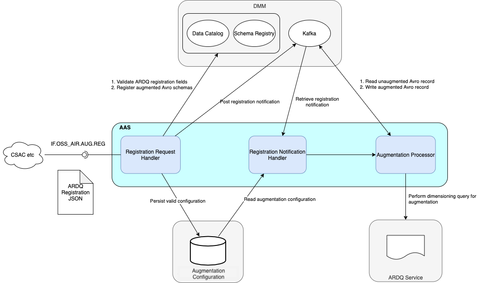
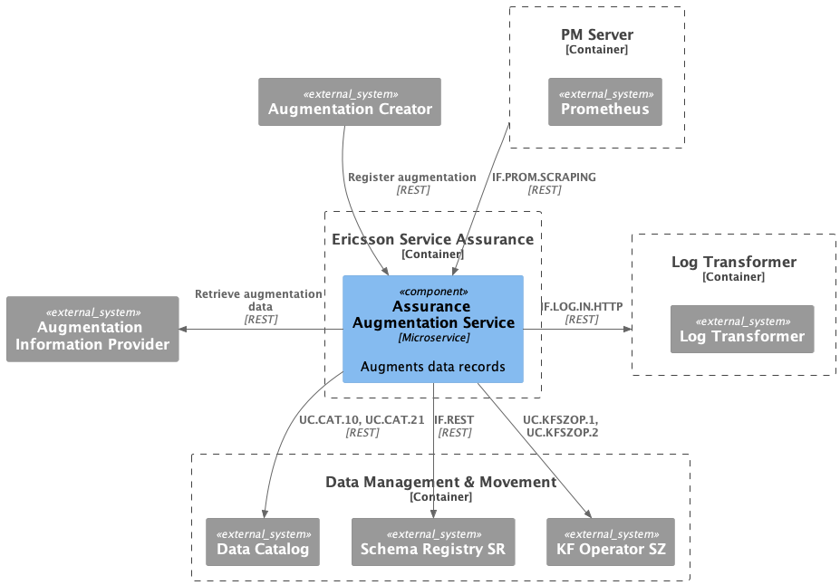

<!--Document Template information:
Prepared:Stefano Volpe
Approved:***
Document Name:user-guide-template
Revision: {!.bob/var.user-guide-version!}
Date: {!.bob/var.date!}
-->

# Assurance Augmentation Service User Guide

[TOC]

## Overview

This document provides an overview of the Assurance Augmentation Service (AAS).
It gives a brief description of its main features and interfaces.

### Revision History

| Date       | Comment               | Author  |
|------------|-----------------------|---------|
| 2023-05-12 | Initial Draft         | ERDRRDH |
| 2023-10-26 | EDB support           | EYONDUU |
| 2023-11-01 | Add Hardening Section | LMCLIAN |
| 2023-11-09 | SIP-TLS support       | EWIRKRI |

### Supported Use Cases

This chapter gives an overview of the supported use cases.

| Use Case ID        | Use Case Title      | Compliance |
|--------------------|---------------------|------------|
| UC.AA.AAS.REGISTER | Create registration | Unstable   |
| UC.AA.AAS.UPDATE   | Update registration | Unstable   |
| UC.AA.AAS.DELETE   | Delete registration | Stable     |

### Maturing Features

There are no Alpha/Beta features included in the release.

#### Enabling Maturing Features

There are no Alpha/Beta features included in the release.

### Architecture

Basic flow for AAS is as follows:

1. Analytics Reporting Dimensioning Query (ARDQ) registration submitted, including the ARDQ service URL (Core Analytics Reporting Dimensioning Query (CARDQ)) and the list of augmentations to apply for a given input Performance Metrics (PM) data schema
2. AAS creates the augmented PM data schema and registers it with the Data Catalog and Schema Registry in the Data Management and Movement (DMM) application
3. AAS registers the output Kafka topic as the destination for augmented PM data records
4. AAS creates the Kafka consumer and starts consuming unaugmented PM data records
5. A data augmentation query is sent to CARDQ using input fields from the unaugmented PM data records
6. An augmented PM data record is created using the data retrieved from CARDQ and written to the previously registered output topic

The following diagram shows the AAS and its architectural context.



Figure 1 Architecture view of Assurance Augmentation Service

#### Application Programming Interfaces (APIs)

The following is an overview of the included APIs and their maturity.
APIs with Alpha or Beta maturity should only be used for tests and are not
ready for production use.

| API                 | API Version | API Slogan       | API Maturity |
|---------------------|-------------|------------------|--------------|
|  IF.OSS_AIR.AUG.REG | 1.0.0       | registration API | Stable       |

### Deployment View

AAS is packaged as a Docker container. It supports deployment in
Kubernetes using Helm.

AAS depends on PostgreSQL, which must be deployed as the database backend for the service.

AAS depends on Kafka, which must be deployed as the data streaming backend for the service.

AAS depends on the Data Catalog and Schema Registry for retrieving existing PM data schemas and registering augmented PM data schemas.

AAS depends on an ARDQ service for retrieving data to create augmented PM data records. For example, the
CARDQ service is deployed as part of the Assurance software system.

AAS integrates with the PM Server to provide metrics.

AAS integrates with the Log Transformer service to supply logs.

AAS integrates with the Service Identity Provider TLS (SIP-TLS) service to enable cluster-internal-secured communication with server and client authentication based on mTLS.

The diagram below shows the AAS in context as it is deployed. In the initial deployment:

* CSAC will be the Augmentation Creator.
* CARDQ will be the Augmentation Information Provider.



Figure 2 Deployment view of Assurance Augmentation Service

To deploy AAS, see the [Deployment section](#deployment) that:

- Explains how to start using AAS in the supported environments.
- Specifies configuration options for starting the AAS Docker container.

If problems occur when using AAS, see the [Troubleshooting section](#troubleshooting).

### Dimensioning and Characteristics

#### Dimensioning

To handle dimensioning configuration at deployment, see the [Deployment section](#deployment).

#### Scaling

| Scaling Supported (Yes/No) | Minimum number of instances | Maximum number of recommended instances |
|----------------------------|-----------------------------|-----------------------------------------|
| Yes                        | 1                           | Number of input Kafka partitions        |

#### Resilience

AAS supports high availability of its REST API through multiple pod instances.

#### High Availability

AAS supports high availability, and the following configurations are provided by default in the values.yaml file:

1. Run multiple instances of microservices that are horizontally scalable (replicaCount default value >= 2)
````text
replicaCount may be changed on the command line line for 'helm deploy' or in values.yaml:

    replicaCount: 2
````
2. Set pod anti-affinity rule to soft in values.yaml such that scheduler still schedules the pod even if it can't find a matching node.
   There are two options: preferredDuringScheduling (or hard) and IgnoredDuringExecution (or soft).
````text
podAntiAffinity can be changed in values.yaml file.

affinity:
  podAntiAffinity: "soft"
````
3. Support setting the topology spread constraints (default = undefined) in the values.yaml to help schedule pods across user-defined topologies, such as zone or regions.
   In topology spread constraints, options include maxSkew, minDomains, topologyKey, labelSelector, label selectors and matchLabelKeys.
````text
nodeSelector: { }
topologySpreadConstraints:
  deployment: []
  test: []
````
4. Configure pre-stop hook with terminationGracePeriodSeconds in values.yaml.
````text
terminationGracePeriodSeconds: 30
````
5. Set the Quality of Service config for pod eviction policy for resource issues on the node to Guaranteed by making resource request memory equals to resource limit memory.
   There are 3 option for Quality of Service class - Guaranteed, Burstable or BestEffort.
   This can be viewed in the specification of containers(pods).
````text
status:
    qosclass: Guaranteed
````
6. Configure the mandatory liveness and readiness health probes in the values.yaml.
````text
probes:
    eric-oss-assurance-augmentation:
        livenessProbe:
            failureThreshold: 3
            initialDelaySeconds: 120
            periodSeconds: 10
            timeoutSeconds: 10
        readinessProbe:
            failureThreshold: 3
            initialDelaySeconds: 120
            periodSeconds: 10
            timeoutSeconds: 10
````

#### Upgrade - In Service Software Upgrade

AAS supports upgrade without loss of the following:
- persistent service configuration data
- notifications

## Deployment

This section describes procedures to deploy and upgrade AAS in a
Kubernetes environment with Helm. It also covers the hardening
guidelines to be considered when deploying the service.

### Prerequisites

- A running Kubernetes environment with Helm support, some knowledge
  of the Kubernetes environment, including the networking detail, and
  access rights to deploy and manage workloads.

- Availability of the kubectl CLI tool with correct authentication
  details. Contact the Kubernetes System Admin if necessary.

- Availability of the Helm package.

- Availability of Helm charts and Docker images for AAS and
  all dependent services.

### Custom Resource Definition Deployment

Custom Resource Definitions (CRD) are cluster-wide resources that must be
installed prior to the Generic Service deployment.
The CRD charts version to be used in the deployment is set by the service
that requires the latest CRD charts version.

> Note! The release name chosen for the CRD charts in the Kubernetes deployment must be
> kept and cannot be changed later.

Helm ALWAYS requires a namespace to deploy a chart. The namespace to be used
for the same per-service CRD charts must be created before the CRD charts are
loaded.

> Note! The upgrade of the CRD charts must be done before deploying a service that
> requires additional CRDs or a CRD chart version newer than the one already deployed on
> the Kubernetes cluster.

The CRD chart is deployed as follows:

1. Download the latest applicable CRD charts files from the helm charts
   repository.

2. If the `namespace` does not already exist, create the `namespace` where the CRD charts will be deployed.
   This step is only done once on the Kubernetes cluster.

    ```
    kubectl create namespace <NAMESPACE-FOR-CRDs>
    ```

3. Deploy the CRD using `helm upgrade` command:

    ```
    helm upgrade --install --atomic <release name> <CRD chart with version> --namespace <NAMESPACE-FOR-CRDs>
    ```

4. Validate the CRD installation with the `helm ls` command:

    ```
    helm ls -a
    ```

In the table, locate the entry for the `<release name>`, validate the
`NAMESPACE` value, and check that the STATUS is set to `deployed`.
When the output is validated, continue with the installation of the helm charts.

### Deployment in a Kubernetes Environment Using Helm

This section describes how to deploy AAS in Kubernetes using Helm and
the `kubectl` CLI client. Helm is a package manager for Kubernetes that
streamlines the installation and management of Kubernetes applications.

#### Preparation

Prepare the Helm chart and Docker images.
Use the Helm chart in the following link for installation:

https://arm.seli.gic.ericsson.se/artifactory/proj-eric-oss-drop-helm/eric-oss-assurance-augmentation/eric-oss-assurance-augmentation-\<version\>.tgz

#### Pre-Deployment Checks for AAS

Ensure the following:

- The <RELEASE_NAME> is not used already in the corresponding cluster.
  Use `helm list` command to list the existing deployments (and delete previous
  deployment with the corresponding <RELEASE_NAME> if needed).

- The same namespace is used for all deployments.

#### Deployment of Required Services

1. [Helm Chart Installation of Service Identity Provider TLS Service](#helm-chart-installation-of-service-identity-provider-tls-service) is recommended to be completed first if any provided or consumed internal interfaces are secured.

2. Mandatory services: [Enterprise Postgres Database](#enterprise-postgres-database), [Helm Chart Installation of DMM Services](#helm-chart-installation-of-data-management-and-movement-dmm-services) and [Log Transformer service](https://adp.ericsson.se/marketplace/log-transformer) unless the configuration parameter `log.streamingMethod` is set to "indirect" as described in [Helm Chart Installation of Log Transformer](#helm-chart-installation-of-log-transformer)

3. When service metrics are to be scraped: [Helm Chart Installation of PM Server](#helm-chart-installation-of-pm-server)

4. An ARDQ Service, for example, see the [Core Analytics Reporting Dimensioning Query User Guide](https://adp.ericsson.se/marketplace/core-analytics-reporting-dimensioning-qu/documentation)


##### Helm Chart Installation of Service Identity Provider TLS Service

When any provided or consumed internal interfaces are secured, the [Service Identity Provider TLS (SIP-TLS)](https://adp.ericsson.se/marketplace/service-identity-provider-tls) service must be deployed to support cluster-internal-secured communication with server and client authentication based on mTLS.

For information related to SIP-TLS service installation,
see [Service Identity Provider TLS User Guide.](https://adp.ericsson.se/marketplace/service-identity-provider-tls/documentation)

###### To Enable mTLS:

Set the configuration parameter `global.security.tls.enabled` to true

The scheme of a consumed REST API must be HTTPS to enable mTLS communication with that API. See the [Configuration Parameters](#configuration-parameters) section for details.


##### Enterprise Postgres Database

AAS utilizes the Enterprise Postgres Database (EDB) as its backend database, which must be installed prior to AAS. A user secret must also be created to provide credentials for AAS.


###### EDB Database user credential secret

Notes: The usernames provided in this secret should be simple text. Do not explicitly enclose the usernames in double quotes ("").
See [Postgresql Documentation](https://www.postgresql.org/docs/current/sql-syntax-lexical.html#SQL-SYNTAX-IDENTIFIERS) for details.

```text
kubectl create secret generic <USER_SECRET> --from-literal=pguserid=<AAS_USER> --from-literal=pgpasswd=<AAS_USER_PWD>  --from-literal=super-user=<SUPER_USER> --from-literal=super-pwd=<SUPER_PWD> --from-literal=metrics-pwd=<METRICS_PWD> --from-literal=replica-user=<REPLICA_USER> --from-literal=replica-pwd=<REPLICA_PWD> --namespace=<NAMESPACE>
```
The variables specified in the command are as follows:

- `<USER_SECRET>`: String value. A secret specified by users to store usernames and passwords in the database. Value should
  be `eric-oss-assurance-augmentation-db-secret` for AAS.
- `<AAS_USER>`: String value. A name customized by users to identify user and is used with `<AAS_USER_PWD>`.
- `<AAS_USER_PWD>`: String value. A password customized by users to identify user and is used with `<AAS_USER>`.
- `<SUPER_PWD>`: String value. A password specified by users for Postgres.
- `<SUPER_USER>`: String value. A admin user specified by users for Postgres.
- `<METRICS_PWD>`: String value. A password specified by users for metrics user "exporter".
- `<REPLICA_USER>`: String value. A username specified by users for backup and restore in the database.
- `<REPLICA_PWD>`: String value. A password specified by users for backup and restore in the database and is used with `<REPLICA_USER>`.
- `<NAMESPACE>`: String value. An area to deploy your own Helm charts instances, separate from other users.

###### EDB Secure Connection Certificates Secret

AAS also supports secure connections to EDB. More detailed configurations can be found in the "Configuration Parameters" section. When the AAS database's `sslMode` is enabled, the Helm chart will mount client and server certificates to AAS microservices, depending on the availability of the secret.

- If no certificates are provided, a non-secure connection will be used to connect to PostgreSQL.
- If a server certificate is provided and `sslMode` is enabled, a TLS connection will be used to connect to PostgreSQL.
- If both server and client certificates are provided and `sslMode` is enabled, an mTLS connection will be used to connect to PostgreSQL.

Here are example scripts for manually creating certificate secrets.

```shell
# Create client certificate
kubectl create secret generic aug-edb-client-cert --from-file=client.crt=./client/client.crt --from-file=client.key=./client/client.key
# Create server certificate
kubectl create secret generic edb-server-cert --from-file=cacert.crt=./root/root.crt
```

##### Helm Chart Installation of Data Management and Movement (DMM) Services

###### Helm Chart Installation of KF Operator SZ Service

For information related to KF Operator SZ service installation,
see [KF Operator SZ User Guide.](https://adp.ericsson.se/marketplace/kf-operator-sz/documentation)

The KF Operator SZ service is the ADP offering of [Strimzi](https://strimzi.io/), which is a Kubernetes operator-based deployment of Apache Kafka.

The DMM application deploys a customized version of the KF Operator SZ service. AAS' default configuration parameter values support this customized version.
This version will be referred to as DMM Kafka, Kafka or Strimzi throughout this documentation. See the [DMM repository](https://gerrit-gamma.gic.ericsson.se/#/admin/projects/OSS/com.ericsson.oss.dmi/eric-oss-dmm) for further information.

###### Helm Chart Installation of Data Catalog Service

For information related to Data Catalog service installation,
see [Data Catalog User Guide.](https://adp.ericsson.se/marketplace/data-catalog/documentation)

###### Helm Chart Installation of Schema Registry SR Service

For information related to Schema Registry SR service installation,
see [Schema Registry User Guide.](https://adp.ericsson.se/marketplace/schema-registry-sr/documentation)

##### Helm Chart Installation of Log Transformer

According to Helm Design rule [DR-D470222-010](https://eteamspace.internal.ericsson.com/display/AA/LOG+general+design+rules#LOGgeneraldesignrules-DR-D470222-010), it is required that all services support three logging methods that align with the ADP log collection pattern.
Each of which are controlled by the `log.streamingMethod` configuration.

- "indirect": Stdout to infrastructure logging framework.
- "direct": Direct streaming to the Log Aggregator (Log Transformer).
- "dual": Stdout to infrastructure logging framework and direct streaming to Log Aggregator.

During deployment, the default streaming method is "direct". The logs will be streamed securely if TLS is globally enabled.
The `.Values.log.streamingMethod` or `.Values.global.log.streamingMethod` configuration can be set to modify the streaming method.

For information related to Log Transformer installation,
see [Log Transformer User Guide.](https://adp.ericsson.se/marketplace/log-transformer/documentation)

##### Helm Chart Installation of PM Server

When service metrics are to be scraped, then the [PM Server](https://adp.ericsson.se/marketplace/pm-server) must be deployed.

For information related to PM server installation,
see [Performance Management (PM) Server User Guide.](https://adp.ericsson.se/marketplace/pm-server/documentation)

#### Helm Chart Installation of AAS

> **Note:** Ensure all dependent services are deployed and healthy before you
> continue with this step (see previous chapter).

Helm is a tool that streamlines installing and managing Kubernetes
applications. AAS can be deployed on Kubernetes using Helm Charts.
Charts are packages of pre-configured Kubernetes resources.

Users can override the default values provided in the values.yaml template of
the helm chart. The recommended parameters to override are listed in
section: [Configuration Parameters](#configuration-parameters).

##### Create Kubernetes Secret for AAS

Kubernetes secret must be created before installing the Helm chart.

Image pull secret must be created as the authentication information to pull the images of AAS.

To create an image pull secret, use the following command:

```text
kubectl create secret docker-registry <pull_secret> --docker-server=<server_url> --docker-username=<user_name> --docker-password=<user_pwd> --docker-email=<user_mail> --namespace=<namespace>
```
The variables specified in the command are as follows:

- `<pull_secret>`: String value. Secret of docker-registry type to authenticate with a container registry to pull a private image.
- `<user_name>`: String value. A name to identify the Docker user and is used with `<user_pwd>`.
- `<user_pwd>`: String value, a password to identify the Docker user and is used with `<user_name>`.
- `<user_mail>`: Docker e-mail addresses of users.

For example:

```text
kubectl create secret docker-registry k8s-registry --docker-server=armdocker.rnd.ericsson.se --docker-username=dockerusername --docker-password=dockerpassword --docker-email=example@ericsson.com --namespace=example
```

##### Deploy AAS

Install AAS on the Kubernetes cluster using the Helm installation command:

```text
helm install <RELEASE_NAME> <CHART_REFERENCE> --namespace <NAMESPACE> [--set <other_parameters>]
```

The variables specified in the command are as follows:

- `<CHART_REFERENCE>`: A path to a packaged chart, a path to an unpacked chart
  directory or a URL.

- `<RELEASE_NAME>`: String value, a name to identify and manage your helm chart.

- `<NAMESPACE>`: String value, a name to be used dedicated by the user for
  deploying own helm charts.

  Helm install command for successful AAS installation:

```text
helm install aas https://arm.seli.gic.ericsson.se/artifactory/proj-eric-oss-drop-helm/eric-oss-assurance-augmentation/eric-oss-assurance-augmentation-1.98.0-1.tgz --namespace example --set appArmorProfile.type=unconfined,global.pullSecret=k8s-registry
```

##### Verify the Assurance Augmentation Service Availability

To verify that the deployment is successful, do as follows:

1. Check if the chart is installed with the provided release name and
   in the related namespace using the following command:

```text
$helm ls <namespace>
```

In a successful deployment, the chart status must be reported as "DEPLOYED".

2. Verify the status of the deployed helm chart.

```text
$helm status <release_name>
```

The status of the Chart should be reported as “DEPLOYED”,
the status of all the Pods should be reported as “Running”,
and the number of Deployments available should be the same as the replica count.

3. Verify that the pods are running
   by getting the status for your pods.

```text
$kubectl get pods --namespace=<namespace> -L role
```

*For example:*

```text
$helm ls example
$helm status examplerelease
$kubectl get pods --namespace=example -L role
```

The status of all the Pods should be reported as "Running" and all the containers in any pod should be reported as "Ready".

### Configuration Parameters

#### Mandatory Configuration Parameters

There are no mandatory configuration parameters for AAS.

#### Optional Configuration Parameters

The following parameters are not mandatory. If these parameters are not explicitly set (using the --set argument),
the default values provided in the Helm chart are used.

Global level parameters allowing customization for eric-oss-assurance-augmentation:

| Variable Name                                                         | Description                                                                                                                                                                                                                                                                                                                                                                          | Default Value                        |
|-----------------------------------------------------------------------|--------------------------------------------------------------------------------------------------------------------------------------------------------------------------------------------------------------------------------------------------------------------------------------------------------------------------------------------------------------------------------------|--------------------------------------|
| global.createSchema                                                   | When set to true, service creates SCHEMA object with the schema user defined at service level                                                                                                                                                                                                                                                                                        | true                                 |
| global.timezone                                                       | The time zone used in the service, valid timezone values are the ones defined in the IANA Timezone Database.                                                                                                                                                                                                                                                                         | UTC                                  |
| global.registry.repoPath                                              | AAS image repo path. Overrides default repoPath.                                                                                                                                                                                                                                                                                                                                     | nil                                  |
| global.registry.url                                                   | Global Docker registry url                                                                                                                                                                                                                                                                                                                                                           | armdocker.rnd.ericsson.se            |
| global.registry.pullPolicy                                            | Global Image pull policy                                                                                                                                                                                                                                                                                                                                                             | IfNotPresent                         |
| global.pullSecret                                                     | Global image pull secret                                                                                                                                                                                                                                                                                                                                                             | ""                                   |
| global.fsGroup.manual                                                 | Setting the fsGroup for PVC                                                                                                                                                                                                                                                                                                                                                          | 10000                                |
| global.fsGroup.namespace                                              | Using the default fsGroup from SCC/PSP                                                                                                                                                                                                                                                                                                                                               | true                                 |
| global.internalIPFamily                                               | This is one optional parameter. If 'internalIPFamily' is set, possible values are: IPv4, IPv6.                                                                                                                                                                                                                                                                                       | nil                                  |
| global.security.policyBinding.create                                  | Whether to create a rolebinding for security policy role                                                                                                                                                                                                                                                                                                                             | false                                |
| global.security.policyReferenceMap.default-restricted-security-policy | Map for changing default name of default restricted security policy                                                                                                                                                                                                                                                                                                                  |                                      |
| global.security.tls.enabled                                           | Enables mTLS on all provided AAS interfaces and allows AAS to establish mTLS connections with consumed interfaces like the DMM Data Catalog service. To enable secured communication with a consumer interface, the scheme of its configured URL must be HTTPS. In addition, this parameter should be set by top level integration chart and not be present in values.yaml of AAS.   | true                                 |
| global.security.tls.trustedInternalRootCa.secret                      | The secret holding the public certificate bundle of the root CA that issues application-internal server certificates and optionally, the infrastructure root CA certificates that the application trusts in the file 'ca.crt'. This public certificate bundle is created by a deployment engineer, which should preferably originate from a cloud PKI service as set of private CAs. | "eric-sec-sip-tls-trusted-root-cert" |

Application level parameters allowing customization for eric-oss-assurance-augmentation:

| Variable Name                                                            | Description                                                                                                                                                                                                                                                                                                                                                                                                   | Default Value                                                   |
|--------------------------------------------------------------------------|---------------------------------------------------------------------------------------------------------------------------------------------------------------------------------------------------------------------------------------------------------------------------------------------------------------------------------------------------------------------------------------------------------------|-----------------------------------------------------------------|
| replicaCount                                                             | AAS replica count                                                                                                                                                                                                                                                                                                                                                                                             | 2                                                               |
| podDisruptionBudget.minAvailable                                         | podDisruptionBudget will protect the service against voluntary disruption. minAvailable is the number of pods that must still be available after the eviction. It can be either an absolute number or a percentage.                                                                                                                                                                                           | "40%"                                                           |
| updateStrategy.type                                                      | Configure and disable automated rolling updates for containers, labels, resource request/limits, and annotations for the Pods in a StatefulSet. Specifies the strategy used to replace old Pods with new ones, only support "RollingUpdate" type.                                                                                                                                                             | RollingUpdate                                                   |
| updateStrategy.rollingUpdate.maxSurge                                    | The maximum number of Pods that can be created over the desired number of Pods                                                                                                                                                                                                                                                                                                                                | 1                                                               |
| updateStrategy.rollingUpdate.maxUnavailable                              | The maximum number of Pods that can be unavailable during the update process                                                                                                                                                                                                                                                                                                                                  | 0                                                               |
| labels                                                                   | A map for setting custom labels for all Kubernetes resources                                                                                                                                                                                                                                                                                                                                                  | {}                                                              |
| imageCredentials.repoPath                                                | AAS image repo path. Overrides global.registry.repoPath and default repoPath. Omit global.registry.repoPath by setting this to empty string.                                                                                                                                                                                                                                                                  |                                                                 |
| imageCredentials.eric-oss-assurance-augmentation.repoPath                | AAS image repo path. Overrides imageCredentials.repoPath and global.registry.repoPath for this image only. Omit repoPath by setting this to empty string.                                                                                                                                                                                                                                                     | proj-eric-oss-drop                                              |
| imageCredentials.eric-oss-assurance-augmentation.registry                | eric-oss-assurance-augmentation image registry name.                                                                                                                                                                                                                                                                                                                                                          |                                                                 |
| imageCredentials.eric-oss-assurance-augmentation.registry.url            | AAS image url. Overrides global.registry.url                                                                                                                                                                                                                                                                                                                                                                  |                                                                 |
| imageCredentials.eric-oss-assurance-augmentation.registry.pullSecret     | AAS image pull secret.                                                                                                                                                                                                                                                                                                                                                                                        |                                                                 |
| imagePullSecrets                                                         | Image pull secrets.                                                                                                                                                                                                                                                                                                                                                                                           | []                                                              |
| nameOverride                                                             | If specified, allows the overriding of the name of all Kubernetes resources in the AAS service.                                                                                                                                                                                                                                                                                                               | nil                                                             |
| fullnameOverride                                                         | If specified, allows the overriding of the full name of all Kubernetes resources in the AAS service.                                                                                                                                                                                                                                                                                                          |                                                                 |
| serviceAccount.create                                                    | It specifies whether a service account should be created.                                                                                                                                                                                                                                                                                                                                                     | true                                                            |
| serviceAccount.name                                                      | The name of the service account to use. If not set and create is true, a name is generated using the fullname template.                                                                                                                                                                                                                                                                                       |                                                                 |
| annotations                                                              | It specifies user defined annotations.                                                                                                                                                                                                                                                                                                                                                                        | {}                                                              |
| service.type                                                             | It determines how the service is exposed to the network. Applicable values: ClusterIP, NodePort, LoadBalancer and ExternalName.                                                                                                                                                                                                                                                                               | ClusterIP                                                       |
| service.port                                                             | Port of the service where AAS listens                                                                                                                                                                                                                                                                                                                                                                         | 8080                                                            |
| ingress.enabled                                                          | If it is set to true then aplication URL can be accessed from outside                                                                                                                                                                                                                                                                                                                                         | false                                                           |
| ingress.ingressClass                                                     | Ingress class name indicating which ingress controller instance is consuming the ingress resource                                                                                                                                                                                                                                                                                                             | OAM-IngressClass                                                |
| ingress.hosts.host                                                       | It specifies the Ingress host                                                                                                                                                                                                                                                                                                                                                                                 | chart-example.local                                             |
| ingress.hosts.paths                                                      | It specified the Ingress path                                                                                                                                                                                                                                                                                                                                                                                 | [//]                                                            |
| eric-pm-server.rbac.appMonitoring.enabled                                | Enables application monitoring if set to true.                                                                                                                                                                                                                                                                                                                                                                | true                                                            |
| terminationGracePeriodSeconds                                            | Time for graceful termination of pod after a termination request is issued.                                                                                                                                                                                                                                                                                                                                   | 30                                                              |
| log.streamingMethod                                                      | Option to configure how logs are treated in the service. Three potential options of "direct" (logs go directly to log transformer and not to stdout), "indirect" (logs go only to stdout). "dual" (logs go to both the log transformer and stdout)                                                                                                                                                            | "direct"                                                        |
| resources.eric-oss-assurance-augmentation.requests.memory                | The requested amount of memory per instance for AAS.                                                                                                                                                                                                                                                                                                                                                          | 4Gi                                                             |
| resources.eric-oss-assurance-augmentation.requests.cpu                   | The requested amount of CPU per instance for AAS.                                                                                                                                                                                                                                                                                                                                                             | 125m                                                            |
| resources.eric-oss-assurance-augmentation.requests.ephemeral-storage     | The requested amount of ephemeral storage per instance for AAS.                                                                                                                                                                                                                                                                                                                                               | ""                                                              |
| resources.eric-oss-assurance-augmentation.limits.memory                  | The maximum amount of memory allowed per instance for AAS.                                                                                                                                                                                                                                                                                                                                                    | 4Gi                                                             |
| resources.eric-oss-assurance-augmentation.limits.cpu                     | The maximum amount of CPU allowed per instance for AAS.                                                                                                                                                                                                                                                                                                                                                       | 500m                                                            |
| resources.eric-oss-assurance-augmentation.limits.ephemeral-storage       | The maximum amount of ephemeral storage per instance for AAS.                                                                                                                                                                                                                                                                                                                                                 | ""                                                              |
| resources.jvm.initialMemoryAllocationPercentage                          | Sets the initial amount of memory that the JVM heap can use in relation to the container memory limit                                                                                                                                                                                                                                                                                                         | 50                                                              |
| resources.jvm.smallMemoryAllocationMaxPercentage                         | Sets the maximum amount of memory that the JVM heap can use in relation to the container memory limit (when the container memory limit < 250 MB)                                                                                                                                                                                                                                                              | 70                                                              |
| resources.jvm.largeMemoryAllocationMaxPercentage                         | Sets the maximum amount of memory that the JVM heap can use in relation to the container memory limit (when the container memory limit > 250 MB)                                                                                                                                                                                                                                                              | 50                                                              |
| autoScaling.enabled                                                      | Parameter to enable autoscaling. If set to true, the replicaCount parameter is ignored.                                                                                                                                                                                                                                                                                                                       | false                                                           |
| autoScaling.minReplicas                                                  | The number of minimum replicas when using autoscaling.                                                                                                                                                                                                                                                                                                                                                        | 1                                                               |
| autoScaling.maxReplicas                                                  | The number of maximum replicas when using autoscaling.                                                                                                                                                                                                                                                                                                                                                        | 100                                                             |
| autoScaling.targetCPUUtilizationPercentage                               | Target CPU utilization percentage when using autoscaling.                                                                                                                                                                                                                                                                                                                                                     | 80                                                              |
| nodeSelector                                                             | Used to constrain a Pod so that it can only run on particular set of Nodes. Service-level parameter of node labels for Pod assignment. If both global and service-level parameters are set, the two values will be merged unless there is an overlap (same key with different values), in which case Helm chart installation of the service will fail.                                                        | {}                                                              |
| topologySpreadConstraints.deployment                                     | The topologySpreadConstraints specifies how to spread pods among the given topology.                                                                                                                                                                                                                                                                                                                          | []                                                              |
| topologySpreadConstraints.test                                           | The topologySpreadConstraints specifies how to spread pods among the given topology for test pod.                                                                                                                                                                                                                                                                                                             | []                                                              |
| tolerations.key                                                          | Sets key for Kubernetes tolerations for AAS pod(s). node.kubernetes.io/not-ready and node.kubernetes.io/unreachable are two default keys defined in AAS chart.                                                                                                                                                                                                                                                | node.kubernetes.io/not-ready and node.kubernetes.io/unreachable |
| tolerations.operator                                                     | Sets operator for Kubernetes toleration for AAS pod(s).                                                                                                                                                                                                                                                                                                                                                       | Exists                                                          |
| tolerations.effect                                                       | Sets effect for Kubernetes tolerations for AAS pods(s).                                                                                                                                                                                                                                                                                                                                                       | NoExecute                                                       |
| tolerations.tolerationSeconds                                            | Sets toleration seconds for Kubernetes tolerations for AAS pod(s).                                                                                                                                                                                                                                                                                                                                            | 0                                                               |
| affinity.podAntiAffinity                                                 | Set pod anti-affinity scheduling rules.Valid values are "soft" or "hard". "hard" indicates that pods must be scheduled on different nodes. "soft" is the preferred way. When the number of Pods is greater than the number of available nodes, "hard" may cause Pods in an unschedulable state.                                                                                                               | soft                                                            |
| probes.eric-oss-assurance-augmentation.livenessProbe.failureThreshold    | The number of failures before considering the liveness probe to have failed for AAS.                                                                                                                                                                                                                                                                                                                          | 3                                                               |
| probes.eric-oss-assurance-augmentation.livenessProbe.initialDelaySeconds | The number of seconds that kubelet waits before performing the first health check probe for AAS.                                                                                                                                                                                                                                                                                                              | 60                                                              |
| probes.eric-oss-assurance-augmentation.livenessProbe.periodSeconds       | The kubelet should perform a liveness probe for the set interval for AAS.                                                                                                                                                                                                                                                                                                                                     | 10                                                              |
| probes.eric-oss-assurance-augmentation.livenessProbe.timeoutSeconds      | The number of seconds to allow before the liveness probe times out for AAS.                                                                                                                                                                                                                                                                                                                                   | 10                                                              |
| probes.eric-oss-assurance-augmentation.readiness.failureThreshold        | The number of failures before considering the readiness probe to have failed for AAS.                                                                                                                                                                                                                                                                                                                         | 3                                                               |
| probes.eric-oss-assurance-augmentation.readiness.initialDelaySeconds     | The number of seconds that kubelet waits before performing the first readiness check for AAS.                                                                                                                                                                                                                                                                                                                 | 60                                                              |
| probes.eric-oss-assurance-augmentation.readiness.periodSeconds           | The kubelet should perform a readiness probe for the set interval for AAS.                                                                                                                                                                                                                                                                                                                                    | 10                                                              |
| probes.eric-oss-assurance-augmentation.readiness.timeoutSeconds          | The number of seconds before considering the readiness probe to have failed for AAS.                                                                                                                                                                                                                                                                                                                          | 10                                                              |
| podPriority.eric-oss-assurance-augmentation.priorityClassName            | PriorityClass name for AAS pod priority. The pod priority will be resolved to value according to the existing priority class. The higher the value, the higher the priority. The pod priority is zero when priorityClassName not set.                                                                                                                                                                         | ""                                                              |
| appArmorProfile.type                                                     | Set appArmorProfile for all containers if appArmorProfile for specific containers were not designated.<br>appArmorProfile.type options list <br>1. unconfined: Indicates that there is no profile loaded. <br>2. runtime/default: Applies the default profile of the container engine. <br>3. localhost: Applies a specific profile loaded on the host. <br>4. "": The appArmor is not set in the Helm chart. | runtime/default                                                 |
| seccompProfile.type                                                      | Set seccompProfile for all containers if seccompProfile for specific containers were not designated.<br>seccompProfile.type options list <br>1. Unconfined: Indicates that there is no profile loaded. <br>2. RuntimeDefault: Applies the default profile of the container engine. <br>3. Localhost: Applies a specific profile loaded on the host. <br>4. "": The seccomp is not set in the Helm chart.      | RuntimeDefault                                                  |
| kubernetesDefaultService.url                                             | kubernetes default service url                                                                                                                                                                                                                                                                                                                                                                                | https://kubernetes.default.svc.cluster.local                    |
| database.host                                                            | Service name of the deployed PostgreSQL database service.                                                                                                                                                                                                                                                                                                                                                     | eric-oss-assurance-augmentation-db                              |
| database.secret                                                          | Database user credential secret name.                                                                                                                                                                                                                                                                                                                                                                         | eric-oss-assurance-augmentation-db-secret                       |
| database.userKey                                                         | Key of customized user name in the database credential secret for user connecting to PostgreSQL database.                                                                                                                                                                                                                                                                                                     | pguserid                                                        |
| database.passwdKey                                                       | Key of customized user password in the database credential secret for user connecting to PostgreSQL database.                                                                                                                                                                                                                                                                                                 | pgpasswd                                                        |
| database.dbaUserKey                                                      | Key of DBA user name in the database credential secret, required if creating DATABASE and/or SCHEMA objects.                                                                                                                                                                                                                                                                                                  | super-user                                                      |
| database.dbaPasswdKey                                                    | Key of DBA user password in the database credential secret, required if creating DATABASE and/or SCHEMA objects.                                                                                                                                                                                                                                                                                              | super-pwd                                                       |
| database.dbName                                                          | Name of database in PostgreSQL database, AAS persists data in this database.                                                                                                                                                                                                                                                                                                                                  | aasdb                                                           |
| database.port                                                            | database port.                                                                                                                                                                                                                                                                                                                                                                                                | 5432                                                            |
| database.vendor                                                          | database vendor.                                                                                                                                                                                                                                                                                                                                                                                              | postgresql                                                      |
| database.jdbcUrl                                                         | Database URL. If 'jdbcUrl' is not provided, build the database URL using the vendor, host, port, and dbName.                                                                                                                                                                                                                                                                                                  |                                                                 |
| database.connectRetries                                                  | The maximum number of retries when attempting to connect to the database. After each failed attempt, Flyway will wait 1 second before attempting to connect again, up to the maximum number of times specified by connectRetries. The interval between retries doubles with each subsequent attempt.                                                                                                          | 9                                                               |
| database.schemaName                                                      | The default schema name of AAS.                                                                                                                                                                                                                                                                                                                                                                               | aug                                                             |
| database.sslMode                                                         | The database's SSL mode. The supported values are disable, require, verify-ca and verify-full.                                                                                                                                                                                                                                                                                                                | disable                                                         |
| database.clientCertSecret                                                | The name of the client certificates secret for database.                                                                                                                                                                                                                                                                                                                                                      | aug-edb-client-cert                                             |
| database.clientCertKey                                                   | The name of the certificate key within client certificates secret.                                                                                                                                                                                                                                                                                                                                            | client.key                                                      |
| database.clientCertRoot                                                  | The name of the root certificate within client certificates secret.                                                                                                                                                                                                                                                                                                                                           | client.crt                                                      |
| database.serverCertSecret                                                | The name of the server certificates secret for database.                                                                                                                                                                                                                                                                                                                                                      | edb-server-cert                                                 |
| database.serverCertKey                                                   | The name of the certificate key within server certificates secret.                                                                                                                                                                                                                                                                                                                                            | cacert.crt                                                      |
| database.retry.maxAttempts                                               | The maximum number of attempts (including the initial call as the first attempt) when connection failed                                                                                                                                                                                                                                                                                                       | 10                                                              |
| database.retry.waitDuration                                              | A fixed wait duration between retry attempts                                                                                                                                                                                                                                                                                                                                                                  | 1s                                                              |
| database.retry.enableExponentialBackoff                                  | Option to enable Exponential backoff for Resilience4j retry                                                                                                                                                                                                                                                                                                                                                   | true                                                            |
| database.retry.exponentialBackoffMultiplier                              | Exponential backoff is a common strategy for handling retries of failed network calls. In simple terms, the clients wait progressively longer intervals between consecutive retries                                                                                                                                                                                                                           | 2                                                               |
| spring.kafka.heartbeat.initialDelay                                      | The initial time to wait in seconds after AAS is ready before starting to send heartbeats to Kafka.                                                                                                                                                                                                                                                                                                           | 60                                                              |
| spring.kafka.heartbeat.fixedDelay                                        | The time to wait in seconds between execution of Kafka heartbeat tasks.                                                                                                                                                                                                                                                                                                                                       | 60                                                              |
| spring.kafka.admin.retry                                                 | Setting a value greater than zero will cause the client to resend any record whose send fails with a potentially transient error.                                                                                                                                                                                                                                                                             | 2                                                               |
| spring.kafka.admin.retryBackoffMs                                        | The amount of time to wait before attempting to retry a failed request to a given topic partition.                                                                                                                                                                                                                                                                                                            | 100                                                             |
| spring.kafka.admin.reconnectBackoffMs                                    | The base amount of time to wait before attempting to reconnect to a given host.                                                                                                                                                                                                                                                                                                                               | 50                                                              |
| spring.kafka.admin.reconnectBackoffMaxMs                                 | The maximum amount of time in milliseconds to wait when reconnecting to a broker that has repeatedly failed to connect.                                                                                                                                                                                                                                                                                       | 30000                                                           |
| spring.kafka.admin.requestTimeoutMs                                      | The configuration controls the maximum amount of time the client will wait for the response of a request.                                                                                                                                                                                                                                                                                                     | 30000                                                           |
| spring.kafka.admin.retryInterval                                         | The canonical backoff period.                                                                                                                                                                                                                                                                                                                                                                                 | 10                                                              |
| spring.kafka.bootstrapServers                                            | Comma-delimited bootstrap server URLs for Kafka. This value will be used if `global.security.tls.enabled` is set to false.                                                                                                                                                                                                                                                                                    | eric-oss-dmm-kf-op-sz-kafka-bootstrap:9092                      |
| spring.kafka.bootstrapServersMtls                                        | Comma-delimited bootstrap server URLs for secured Kafka. This value will be used if `global.security.tls.enabled` is set to true.                                                                                                                                                                                                                                                                             | eric-oss-dmm-kf-op-sz-kafka-bootstrap:9093                      |
| spring.kafka.issuerReference                                             | The identifier for the Issuer Certificate Authority that issues the Kafka client certificates when TLS is globally enabled.                                                                                                                                                                                                                                                                                   | eric-oss-dmm-kf-op-sz-clients-ca-cert                           |                                                                                                                                                                                                                                                                                                                                                                                                              |                                                                 |
| spring.kafka.strimziCluster                                              | The name of the Strimzi cluster.                                                                                                                                                                                                                                                                                                                                                                              | eric-oss-dmm-kf-op-sz                                           |
| spring.kafka.autoConfigTopics.notification.partitions                    | The number of partitions.                                                                                                                                                                                                                                                                                                                                                                                     | 1                                                               |
| spring.kafka.autoConfigTopics.notification.replicas                      | The number of replicas.                                                                                                                                                                                                                                                                                                                                                                                       | 1                                                               |
| spring.kafka.autoConfigTopics.notification.retention                     | This configuration controls the maximum time we will retain a log before we will discard old log segments to free up space if we are using the "delete" retention policy.                                                                                                                                                                                                                                     | 600000                                                          |
| spring.kafka.autoConfigTopics.notification.minInSyncReplicas             | The minimum number of replicas that must acknowledge a write for the write to be considered successful. This number must small or equal to number of replicas.                                                                                                                                                                                                                                                | 1                                                               |
| spring.kafka.autoConfigTopics.augmentationProcessing.partitions          | The number of partitions.                                                                                                                                                                                                                                                                                                                                                                                     | 3                                                               |
| spring.kafka.autoConfigTopics.augmentationProcessing.replicas            | The number of replicas.                                                                                                                                                                                                                                                                                                                                                                                       | 1                                                               |
| spring.kafka.autoConfigTopics.augmentationProcessing.compression         | Compression type for the given topic.                                                                                                                                                                                                                                                                                                                                                                         | "lz4"                                                           |
| spring.kafka.autoConfigTopics.augmentationProcessing.retention           | This configuration controls the maximum time we will retain a log before we will discard old log segments to free up space if we are using the "delete" retention policy.                                                                                                                                                                                                                                     | 7200000                                                         |
| spring.kafka.autoConfigTopics.augmentationProcessing.minInSyncReplicas   | The minimum number of replicas that must acknowledge a write for the write to be considered successful. This number must small or equal to number of replicas.                                                                                                                                                                                                                                                | 1                                                               |
| spring.kafka.registrationNotification.consumer.maxPollRecords            | The integer number to define the maximum poll records of the consumer.                                                                                                                                                                                                                                                                                                                                        | 1000                                                            |
| spring.kafka.registrationNotification.consumer.maxPollIntervalMs         | The integer number to define the maximum poll intervals of the consumer.                                                                                                                                                                                                                                                                                                                                      | 30000                                                           |
| spring.kafka.registrationNotification.producer.requestTimeoutMs          | The integer number to define the request time out of the producer.                                                                                                                                                                                                                                                                                                                                            | 30000                                                           |
| spring.kafka.augmentationProcessing.consumer.maxPollRecords              | The integer number to define the maximum poll records of the consumer.                                                                                                                                                                                                                                                                                                                                        | 100                                                             |
| spring.kafka.augmentationProcessing.consumer.maxPollIntervalMs           | The integer number to define the maximum poll intervals of the consumer.                                                                                                                                                                                                                                                                                                                                      | 300000                                                          |
| spring.kafka.augmentationProcessing.producer.requestTimeoutMs            | The configuration controls the maximum amount of time the client will wait for the response of a request.                                                                                                                                                                                                                                                                                                     | 30000                                                           |
| spring.kafka.augmentationProcessing.producer.retryBackoffMs              | The amount of time to wait before attempting to retry a failed request to a given topic partition.                                                                                                                                                                                                                                                                                                            | 100                                                             |
| spring.kafka.augmentationProcessing.producer.reconnectBackoffMs          | The base amount of time to wait before attempting to reconnect to a given host.                                                                                                                                                                                                                                                                                                                               | 50                                                              |
| spring.kafka.augmentationProcessing.producer.reconnectBackoffMaxMs       | The maximum amount of time in milliseconds to wait when reconnecting to a broker that has repeatedly failed to connect.                                                                                                                                                                                                                                                                                       | 30000                                                           |
| spring.kafka.augmentationProcessing.producer.batchSize                   | The producer will attempt to batch records together into fewer requests whenever multiple records are being sent to the same partition.                                                                                                                                                                                                                                                                       | 2000                                                            |
| spring.kafka.augmentationProcessing.producer.bufferMemory                | The total bytes of memory the producer can use to buffer records waiting to be sent to the server.                                                                                                                                                                                                                                                                                                            | 32000000                                                        |
| spring.kafka.augmentationProcessing.producer.maxRequestSize              | The maximum size of a request in bytes.                                                                                                                                                                                                                                                                                                                                                                       | 2000                                                            |
| spring.kafka.augmentationProcessing.producer.linger                      | The producer groups together any records that arrive in between request transmissions into a single batched request.                                                                                                                                                                                                                                                                                          | 2000                                                            |
| spring.kafka.availability.retryInterval                                  | Interval between retry attempts to connect Kafka server.                                                                                                                                                                                                                                                                                                                                                      | 10000                                                           |
| spring.kafka.availability.retryAttempts                                  | Number of retry attempts to connect Kafka server.                                                                                                                                                                                                                                                                                                                                                             | 2147483647                                                      |
| dmm.schemaRegistry.url                                                   | Kubernetes service url for accessing the Schema Registry host.                                                                                                                                                                                                                                                                                                                                                | http://eric-schema-registry-sr:8081                             |
| dmm.schemaRegistry.circuitBreaker.failureRateThreshold                   | Configures the failure rate threshold for Schema Registry in percentage.                                                                                                                                                                                                                                                                                                                                      | 50                                                              |
| dmm.schemaRegistry.circuitBreaker.minimumNumberOfCalls                   | Configures the minimum number of calls which are required before the CircuitBreaker can calculate the error rate.                                                                                                                                                                                                                                                                                             | 15                                                              |
| dmm.schemaRegistry.circuitBreaker.waitDurationInOpenState                | The time that the CircuitBreaker should wait before transitioning from open to half-open. (in ms)                                                                                                                                                                                                                                                                                                             | 50000                                                           |
| dmm.schemaRegistry.circuitBreaker.permittedNumberOfCallsInHalfOpenState  | Configures the number of permitted calls when the CircuitBreaker is half open.                                                                                                                                                                                                                                                                                                                                | 9                                                               |
| dmm.schemaRegistry.circuitBreaker.slidingWindowSize                      | Configures the size of the sliding window which is used to record the outcome of calls when the CircuitBreaker is closed.                                                                                                                                                                                                                                                                                     | 30                                                              |
| dmm.schemaRegistry.circuitBreaker.slidingWindowType                      | Configures the type of the sliding window which is used to record the outcome of calls when the CircuitBreaker is closed. (COUNT_BASED or TIME_BASED)                                                                                                                                                                                                                                                         | count_based                                                     |
| dmm.schemaRegistry.retry.maxAttempts                                     | The maximum number of attempts (including the initial call as the first attempt)                                                                                                                                                                                                                                                                                                                              | 3                                                               |
| dmm.schemaRegistry.retry.waitDuration                                    | A fixed wait duration between retry attempts                                                                                                                                                                                                                                                                                                                                                                  | 1s                                                              |
| dmm.schemaRegistry.retry.enableExponentialBackoff                        | Option to enable Exponential backoff for Resilience4j retry                                                                                                                                                                                                                                                                                                                                                   | true                                                            |
| dmm.schemaRegistry.retry.exponentialBackoffMultiplier                    | Exponential backoff is a common strategy for handling retries of failed network calls. In simple terms, the clients wait progressively longer intervals between consecutive retries                                                                                                                                                                                                                           | 2                                                               |
| dmm.dataCatalog.url                                                      | Kubernetes service url for accessing the Data Catalog host.                                                                                                                                                                                                                                                                                                                                                   | http://eric-oss-data-catalog:9590                               |
| dmm.dataCatalog.circuitBreaker.failureRateThreshold                      | Configures the failure rate threshold for Data Catalog in percentage.                                                                                                                                                                                                                                                                                                                                         | 50                                                              |
| dmm.dataCatalog.circuitBreaker.minimumNumberOfCalls                      | Configures the minimum number of calls which are required before the CircuitBreaker can calculate the error rate.                                                                                                                                                                                                                                                                                             | 15                                                              |
| dmm.dataCatalog.circuitBreaker.waitDurationInOpenState                   | The time that the CircuitBreaker should wait before transitioning from open to half-open. (in ms)                                                                                                                                                                                                                                                                                                             | 50000                                                           |
| dmm.dataCatalog.circuitBreaker.permittedNumberOfCallsInHalfOpenState     | Configures the number of permitted calls when the CircuitBreaker is half open.                                                                                                                                                                                                                                                                                                                                | 9                                                               |
| dmm.dataCatalog.circuitBreaker.slidingWindowSize                         | Configures the size of the sliding window which is used to record the outcome of calls when the CircuitBreaker is closed.                                                                                                                                                                                                                                                                                     | 30                                                              |
| dmm.dataCatalog.circuitBreaker.slidingWindowType                         | Configures the type of the sliding window which is used to record the outcome of calls when the CircuitBreaker is closed. (COUNT_BASED or TIME_BASED                                                                                                                                                                                                                                                          | count_based                                                     |
| dmm.dataCatalog.retry.maxAttempts                                        | The maximum number of attempts (including the initial call as the first attempt)                                                                                                                                                                                                                                                                                                                              | 3                                                               |
| dmm.dataCatalog.retry.waitDuration                                       | A fixed wait duration between retry attempts                                                                                                                                                                                                                                                                                                                                                                  | 1s                                                              |
| dmm.dataCatalog.retry.enableExponentialBackoff                           | Option to enable Exponential backoff for Resilience4j retry                                                                                                                                                                                                                                                                                                                                                   | true                                                            |
| dmm.dataCatalog.retry.exponentialBackoffMultiplier                       | Exponential backoff is a common strategy for handling retries of failed network calls. In simple terms, the clients wait progressively longer intervals between consecutive retries                                                                                                                                                                                                                           | 2                                                               |
| ardq.circuitBreaker.failureRateThreshold                                 | Configures the failure rate threshold for ARDQ in percentage.                                                                                                                                                                                                                                                                                                                                                 | 50                                                              |
| ardq.circuitBreaker.minimumNumberOfCalls                                 | Configures the minimum number of calls which are required before the CircuitBreaker can calculate the error rate.                                                                                                                                                                                                                                                                                             | 15                                                              |
| ardq.circuitBreaker.waitDurationInOpenState                              | The time that the CircuitBreaker should wait before transitioning from open to half-open. (in ms)                                                                                                                                                                                                                                                                                                             | 50000                                                           |
| ardq.circuitBreaker.permittedNumberOfCallsInHalfOpenState                | Configures the number of permitted calls when the CircuitBreaker is half open.                                                                                                                                                                                                                                                                                                                                | 9                                                               |
| ardq.circuitBreaker.slidingWindowSize                                    | Configures the size of the sliding window which is used to record the outcome of calls when the CircuitBreaker is closed.                                                                                                                                                                                                                                                                                     | 30                                                              |
| ardq.circuitBreaker.slidingWindowType                                    | Configures the type of the sliding window which is used to record the outcome of calls when the CircuitBreaker is closed. (COUNT_BASED or TIME_BASED)                                                                                                                                                                                                                                                         | count_based                                                     |
| ardq.retry.maxAttempts                                                   | The maximum number of attempts. (including the initial call as the first attempt)                                                                                                                                                                                                                                                                                                                             | 5                                                               |
| ardq.retry.waitDuration                                                  | A fixed wait duration between retry attempts.                                                                                                                                                                                                                                                                                                                                                                 | 1s                                                              |
| ardq.retry.enableExponentialBackoff                                      | Option to enable Exponential backoff for Resilience4j retry.                                                                                                                                                                                                                                                                                                                                                  | true                                                            |
| ardq.retry.exponentialBackoffMultiplier                                  | Exponential backoff is a common strategy for handling retries of failed network calls. In simple terms, the clients wait progressively longer intervals between consecutive retries.                                                                                                                                                                                                                          | 2                                                               |
| analytics.target                                                         | Analytics target that computes KPIs. (Example: pmsch). If this property is set to 'pmsch' and the output schema names are too long then hash based output schema names are generated.                                                                                                                                                                                                                         | pmsch                                                           |

### Service Dimensioning

By default, the service provides resource request values and resource limit
values as part of the Helm chart. These values correspond to a default size for
deployment of an instance. This section provides guidance
on how to perform service dimensioning and change the default values when needed.

#### Override Default Dimensioning Configuration

If values different from the default values are preferred for resource request and resource limit,
the default values  must be overridden at deployment.

Here is an example of the `helm install` command where
the values of resource requests and resource limits are set at deployment to override the default values:

```text
helm install aas https://arm.seli.gic.ericsson.se/artifactory/proj-eric-oss-drop-helm/eric-oss-assurance-augmentation/eric-oss-assurance-augmentation-1.98.0-1.tgz --namespace test-deployment-namespace --set resources.eric-oss-assurance-augmentation.requests.memory=128Mi,resources.eric-oss-assurance-augmentation.requests.cpu=100m,resources.eric-oss-assurance-augmentation.requests.ephemeral-storage=1Gi,resources.eric-oss-assurance-augmentation.limits.memory=1Gi,resources.eric-oss-assurance-augmentation.limits.cpu=250m,resources.eric-oss-assurance-augmentation.limits.ephemeral-storage=1Gi
```

#### Use Minimum Configuration per Service Instance

This section specifies the minimum recommended configuration per service
instance.

| Resource Type (Kubernetes Service) | Resource Request Memory | Resource Limit Memory | Resource Request CPU | Resource Limit CPU |
|------------------------------------|-------------------------|-----------------------|----------------------|--------------------|
| AAS                                | 2GB                     | 2GB                   | 500m                 | 500m               |

To use minimum configuration, override the default values for resource requests
and resource limits in the Helm chart at deployment.

#### Use Maximum (Default) Configuration per Service Instance

The maximum recommended configuration per instance is provided as default in the
Helm chart. The default for both Resource Request values and Resource Limit values are included
in the Helm charts.

### Hardening

#### General information about hardening

Product hardening is a process which is required to eliminate the attack by using only essential libraries as well as scanning all the vulnerabilities. This is to ensure that there should not be any exposure to malicious attacks.

#### Hardening during product development

- The service is built on minimalistic container images with small footprints, and it includes only those libraries which are essential.
- The service utilizes a container optimized operating system (Common Base OS) and latest security patches are also applied on it.
- The service is also configured to strict minimum of services and ports to minimize the attack surface.
- The containers also go through vulnerability scanning to eliminate the vulnerabilities from the code.

#### Hardening during service delivery

The service can be further hardened by configuring settings related to AppArmor and Seccomp which are done through the Helm parameters located under `.Values.appArmorProfile` and `.Values.seccompProfile`, respectively.

To use the default AppArmor and Seccomp profiles, one can install AAS by setting these parameters during installation:

```text
--set appArmorProfile.type=runtime/default,seccompProfile.type=RuntimeDefault
```

See [Configuration Parameters](#configuration-parameters) for further details.

#### Services, Ports, and Protocols

AAS is dependent on the services:

- EDB
- DMM Kafka
- DMM Data Catalog
- DMM Schema Registry
- ARDQ

AAS integrates with the services:

- PM Server
- Log Transformer
- Service Identity Provider TLS (SIP-TLS)

AAS does not expose any ports outside the cluster. See the sections [Internal Ports](#internal-ports) and [External Ports](#external-ports) for more information.

#### Certificate Management

- SIP-TLS manages the generation and maintenance of certificates for the AAS REST API and its dependencies, such as DMM Kafka, DMM Schema Registry, and DMM Data Catalog.
- Certificates related to the EDB are managed externally to SIP-TLS and must be provided prior to AAS deployment. For more information, see the [EDB Secure Connection Certificates Secret](#edb-secure-connection-certificates-secret) section.

#### Handling patches

To update the deployment, run the following command: (Please refer to section [Upgrade Procedures](#upgrade-procedures) for more information)

```
helm upgrade --atomic <RELEASE_NAME> <CHART_PATH> [--set <previous_customized_value> ..]
```

_Note: By adding the `--atomic` flag, the upgrade process can roll back any changes if the upgrade fails. This could strengthen the hardening of our microservice during upgrades._


#### References

See the following documents for more details:
- [Hardening Guideline Instruction](https://erilink.ericsson.se/eridoc/erl/objectId/09004cff8b35654f?docno=LME-16:002235Uen&action=approved&format=msw12)<br/>
- [Hardening Guideline Template](https://erilink.ericsson.se/eridoc/erl/objectId/09004cff8b355119?docno=LME-16:002234Uen&action=approved&format=msw12)<br/>
- [Recommended Hardening Activities](https://erilink.ericsson.se/eridoc/erl/objectId/09004cffc724ed0d?docno=GFTL-21:000631Uen&action=approved&format=msw12)<br/>
- [Kubernetes Security Design Rules](https://eteamspace.internal.ericsson.com/display/AA/Kubernetes+Security+Design+Rules)<br/>

### Upgrade Procedures

> **Note:** If any chart value is customized during upgrade through the
> "--set" option of the "helm upgrade" command, all other previously customized
> values will be replaced with the ones included in the new version of the chart.
> To ensure that any customized values are carried forward as part of the
> upgrade, consider keeping a versioned list of such values. The versioned list should be
> provided as input to the upgrade command in order to be able to use the "--set"
> option without side effects.

Upgrade AAS using the command:

```text
helm upgrade <RELEASE_NAME> <CHART_REFERENCE> --namespace <NAMESPACE> [--set <other_parameters>]
```

*For Example:*
```text
helm upgrade aas https://arm.seli.gic.ericsson.se/artifactory/proj-eric-oss-drop-helm/eric-oss-assurance-augmentation/eric-oss-assurance-augmentation-1.98.0-1.tgz --namespace test-deployment-namespace --set appArmorProfile.type=unconfined,global.pullSecret=k8s-registry
```

## Security Guidelines

### Operative Tasks

This service does not include any operative tasks.

### External Ports

No ports are exposed to the outside of the cluster.

### Internal Ports

The following are cluster internal ports that are not exposed outside the cluster. The port number can be changed via the configuration parameter `service.port`.
See the [Configuration Parameters](#configuration-parameters) section.

| Service or Interface name | Protocol | IP Address Type | Default Port | Transport Protocol | IP Version    |
|---------------------------|----------|-----------------|--------------|--------------------|---------------|
| IF.OSS_AIR.AUG.REG        | HTTP     | Hostname        | 8080         | TCP                | IPv4 and IPv6 |
| IF.OSS_AIR.AUG.REG        | HTTPS    | Hostname        | 8443         | TCP                | IPv4 and IPv6 |

### Certificates

See [Certificate Management](#certificate-management)

### Security Events That Can Be Logged

This service generates log events for

- startup, shutdown and restart of the service.
- on certificate loading and reloading.
- on SSL context generation.
- on connection failures between software components.

| Event Type                                                      | Log Level | Event Log                                                                                                                             |
|-----------------------------------------------------------------|-----------|---------------------------------------------------------------------------------------------------------------------------------------|
| Service Starting                                                | Info      | AAS starting                                                                                                                          |
| Service Shutting Down                                           | Info      | AAS shutting down                                                                                                                     |
| Certificate Change Detected                                     | Warn      | Certificate change detected for {certificate name}, content: {store type}                                                             |
| Certificate Loading Starting                                    | Warn      | Subscribing to certificate changes in {directory}                                                                                     |
| Certificate Loading Started                                     | Warn      | Loading new certificates from {directory}                                                                                             |
| Certificate Loading Started                                     | Warn      | New SSL context set                                                                                                                   |
| Certificate Reloading Starting                                  | Warn      | Reloading security configuration                                                                                                      |
| Certificate Reloading Started                                   | Warn      | Reloaded REST clients with new SSL context                                                                                            |
| Certificate Reloading Started                                   | Warn      | Reloaded server with new SSL context                                                                                                  |
| Certificate Reloading Started                                   | Warn      | New SSL context set                                                                                                                   |
| Certificate Reloading Completed                                 | Warn      | Completed reloading security configuration                                                                                            |
| Failure during SSL Context Creation                             | Warn      | New SSL context is empty                                                                                                              |
| Failure during SSL Context Creation                             | Warn      | Cannot create SSL context: {exception}                                                                                                |
| Failure during SSL Context Creation                             | Warn      | Cannot create AAS' keystore/truststore: {exception}                                                                                   |
| Failed to Refresh SSL Context                                   | Warn      | Cannot refresh server SSL context: {exception}                                                                                        |
| Kafka Certificate Loading Starting                              | Warn      | Changes detected in Kafka-related TLS Contexts. After verifying the Kafka connection, the Kafka Client configuration will be reloaded |
| Kafka Certificate Loading Successful                            | Warn      | Successfully configured secure Kafka communication                                                                                    |
| Kafka Certificate Reloading Starting                            | Warn      | Reloading Kafka Configuration                                                                                                         |
| Kafka Certificate Reloading Successful                          | Warn      | Reloaded Kafka Configuration                                                                                                          |
| Kafka Producers Reloading Starting                              | Warn      | Reloading Kafka producers configuration                                                                                               |
| Kafka Producers Reloading Successful                            | Warn      | Reloaded Kafka producers configuration                                                                                                |
| Kafka Consumers Reloading Starting                              | Warn      | Reloading Kafka consumers configuration                                                                                               |
| Kafka Consumers Reloading Successful                            | Warn      | Reloaded Kafka consumers configuration                                                                                                |
| Failure while Loading Kafka Certificates                        | Warn      | Missing/invalid certificates in {directory}                                                                                           |
| Failure while Loading Kafka Certificates                        | Warn      | Missing context to configure secure Kafka communication                                                                               |
| Failure while Reloading Kafka Certificates                      | Warn      | Cannot reload Kafka consumers: {exception}                                                                                            |
| Failure while Processing Kafka Certificates                     | Warn      | Error during processing kafka certificates: {exception}                                                                               |
| Failure while Processing Kafka Certificates                     | Warn      | The monitor for the Kafka Certificates has unexpectedly shut down                                                                     |
| Connectivity Failure between AAS and Downstream REST Server     | Error     | {end point}: {HTTP status code} {HTTP status reason phrase}                                                                           |
| Connectivity Failure between AAS and DMM Schema Registry        | Error     | Schema Registry request failed: {HTTP status code} {HTTP status reason phrase}                                                        |
| Connectivity Failure between AAS and DMM Schema Registry        | Error     | Schema Registry request failed: {exception}                                                                                           |
| Retry Attempts Exhausted between AAS and Downstream REST Server | Error     | Retries exhausted after {number} attempts. Cause: {exception}                                                                         |
| Connectivity Failure between AAS and EDB                        | Error     | Flyway migration failed: {exception message}                                                                                          |
| Connectivity Failure between AAS and EDB                        | Error     | Baselining migrations failed: {exception message}                                                                                     |
| Connectivity Failure between AAS and EDB                        | Error     | Cannot connect to database: {exception}                                                                                               |
| Connectivity Failure between AAS and Kafka                      | Error     | Cannot connect to Kafka: {exception}                                                                                                  |

## Privacy User Guidelines

The service does not collect, store, or process personal data on its own.

## Operation and Maintenance

### Performance Management

#### Custom Metrics

Following table lists the description of AAS monitoring metrics.
> Metrics of the counter type track only the count of a single AAS instance. All counters reset when AAS restarts.

| PM Metric                                 | Metric Description                                             | Metric Type | Metric Status |
|-------------------------------------------|----------------------------------------------------------------|-------------|---------------|
| aas_augmentation_output_records_int_total | Count of output records                                        | Counter     | beta          |
| aas_input_records_int_total               | Count of input records that do not require augmentation        | Counter     | beta          |
| aas_augmentation_input_records_int_total  | Count of input records to be augmented                         | Counter     | beta          |
| aas_augmentation_errors_int_total         | Count of augmentation processing errors                        | Counter     | beta          |
| aas_deleted_registrations_int_total       | Count of successfully deleted ARDQ registrations               | Counter     | beta          |
| aas_created_registrations_int_total       | Count of successfully created ARDQ registrations               | Counter     | beta          |
| aas_updated_registrations_int_total       | Count of successfully updated ARDQ registrations               | Counter     | beta          |
| aas_registrations_int_total               | Total count of ARDQ registrations                              | Gauge       | beta          |
| aas_ardq_valid_responses_int_total        | Count of valid ARDQ responses during augmentation processing   | Counter     | beta          |
| aas_ardq_invalid_responses_int_total      | Count of invalid ARDQ responses during augmentation processing | Counter     | beta          |
| aas_ardq_error_responses_int_total        | Count of error ARDQ responses during augmentation processing   | Counter     | beta          |

### Scaling

AAS supports scaling. The following characteristics must be taken into account when scaling AAS:

- spring.kafka.autoConfigTopics.augmentationProcessing.partitions
- spring.kafka.autoConfigTopics.augmentationProcessing.replicas
- spring.kafka.autoConfigTopics.augmentationProcessing.compression
- spring.kafka.autoConfigTopics.augmentationProcessing.retention

## Troubleshooting

This section describes the troubleshooting functions and procedures for AAS. It provides the
following information:

- Simple verification and possible recovery.

- The required information when reporting a bug or writing a support case,
  including all files and system logs that are needed.

- How to retrieve the above information from the system.

### Prerequisites

- `kubectl` CLI tool properly configured

<!--
To be updated. See https://jira-oss.seli.wh.rnd.internal.ericsson.com/browse/IDUN-87270
### Health Checks

<*Suggest procedures to verify the health of the service to verify it is working
as expected.*>
-->

### Installation

If AAS does not install properly and fails to start, collect the logs and restart the deployment.

1. Collect the logs by following the steps in the [Data Collection](#data-collection) section below.

2. When the logs are collected, restart the deployment.

```text
kubectl rollout restart deployment <deployment_name> -n <namespace>
```

Result: The deployment is restarted and functions properly.

If the pods still fail to start, follow the steps in the [Bug Reporting and
Additional Support](#bug-reporting-and-additional-support) section below.

### Uninstall a Release

To uninstall AAS, follow these steps:

1. Collect the logs by following the steps in the [Data Collection](#data-collection) section below.

2. Uninstall using this command:
```text
helm uninstall <release_name> -n <namespace>
```

### Enable Debug Logging

Log level can be set dynamically during run-time by modifying a configuration file made available to the service by a Kubernetes ConfigMap. The JSON file contains the desired log level, which can be set in lower case, and the name of the container.

The log level can be set to `debug` as follows:

`kubectl get configmaps eric-oss-assurance-augmentation-log-config -n <namespace> -o yaml | sed -E 's/severity": .*/severity": "debug"/' | kubectl replace -f -`

Only enable debug logging to troubleshoot a problem that can be reproduced. Debug logging may impact performance.

### Data Collection

- The detailed information about the pod are collected using the commands:

```text
kubectl describe pod <pod_name> --namespace=<namespace>
kubectl exec <pod_name> --namespace=<namespace> -- env
```

- If the log streaming method is set to "indirect" or "dual", use this command to collect the logs:

```text
kubectl logs <pod_name> --namespace=<namespace>
```

If the log streaming method is set to "direct" or "dual", then the logs will be stored by the Log Transformer service.
By default, the log streaming method is set to "direct" and the Log Transformer service is configured to store log events in the Search Engine.
In the Search Engine, the logs will be indexed in an index named adp-app-logs-YYYY.MM.DD.hh according to the UTC time zone.
Refer to [Log Transformer service](https://adp.ericsson.se/marketplace/log-transformer) for more information.


### SSL Handshake Failures

#### Example One

AAS Logs:
```text
INFO  o.apache.kafka.clients.NetworkClient - [AdminClient clientId=adminclient-1] Node -1 disconnected.
INFO  o.apache.kafka.clients.NetworkClient - [AdminClient clientId=adminclient-1] Cancelled in-flight API_VERSIONS request with correlation id 10 due to node -1 being disconnected (elapsed time since creation: 32ms, elapsed time since send: 32ms, request timeout: 3600000ms)
INFO  o.a.k.c.a.i.AdminMetadataManager - [AdminClient clientId=adminclient-1] Metadata update failed
org.apache.kafka.common.errors.TimeoutException: Timed out waiting for a node assignment. Call: fetchMetadata
INFO  o.a.kafka.common.utils.AppInfoParser - App info kafka.admin.client for adminclient-1 unregistered
INFO  o.a.k.c.a.i.AdminMetadataManager - [AdminClient clientId=adminclient-1] Metadata update failed
org.apache.kafka.common.errors.TimeoutException: The AdminClient thread has exited. Call: fetchMetadata
INFO  o.a.k.clients.admin.KafkaAdminClient - [AdminClient clientId=adminclient-1] Timed out 1 remaining operation(s) during close.
INFO  o.a.kafka.common.metrics.Metrics - Metrics scheduler closed
INFO  o.a.kafka.common.metrics.Metrics - Closing reporter org.apache.kafka.common.metrics.JmxReporter
INFO  o.a.kafka.common.metrics.Metrics - Metrics reporters closed
ERROR c.e.o.a.a.h.exception.FaultHandler - Fatal error. Service restart may be required. org.apache.kafka.common.errors.TimeoutException: Timed out waiting for a node assignment. Call: listNodes
...
ERROR c.e.o.a.a.h.exception.FaultHandler - Fatal error. Service restart may be required. org.apache.kafka.common.errors.TimeoutException: Timed out waiting for a node assignment. Call: listNodes
ERROR o.s.boot.SpringApplication - Application run failed
com.ericsson.oss.air.exception.UnsatisfiedExternalDependencyException: Kafka not available
...
```

Kafka Logs:
```text
INFO [SocketServer listenerType=ZK_BROKER, nodeId=2] Failed authentication with /192.168.71.41 (channelId=192.168.135.49:9093-192.168.71.41:52520-12) (SSL handshake failed) (org.apache.kafka.common.network.Selector) [data-plane-kafka-network-thread-2-ListenerName(TLS-9093)-SSL-6]
```

Possible causes:

- AAS failed to load certificates, failed to add certificates to its KeyStore, or failed to add certificates to its TrustStore.


#### Example Two

AAS Logs:
```text
ERROR com.ericsson.oss.air.aas.handler.exception.FaultHandler - Fatal error. Service restart may be required. org.apache.kafka.common.errors.SslAuthenticationException: Failed to process post-handshake messages
```

Kafka Logs:
```text
INFO [SocketServer listenerType=ZK_BROKER, nodeId=0] Failed authentication with /192.168.125.162 (channelId=192.168.234.66:9093-192.168.125.162:52550-11) (SSL handshake failed) (org.apache.kafka.common.network.Selector) [data-plane-kafka-network-thread-0-ListenerName(TLS-9093)-SSL-5]
```

Possible causes:

- The configuration parameter value `spring.kafka.issuerReference` is incorrect.


#### Recommended Actions

- Check AAS' logs for warning and error events, especially [security events](#security-events-that-can-be-logged).
- Check the health of SIP-TLS and its dependent services. If any of the services are unhealthy, consult their documentation.


### Bug Reporting and Additional Support

Issues can be handled in different ways, as listed below:

-   For questions, support or hot requesting, see
    Additional Support.

-   For reporting of faults, see Bug Reporting.

#### Additional Support

If there are AAS support issues, then use the [Team Swordform page](https://confluence-oss.seli.wh.rnd.internal.ericsson.com/display/AAP/Team+Swordform) and follow the [Assurance Bugs Handling page](https://confluence-oss.seli.wh.rnd.internal.ericsson.com/pages/viewpage.action?spaceKey=AAP&title=Assurance+Bugs+Handling) except use 'Support' for the Issue Type field.

#### Bug Reporting

If there is a suspected fault, then report a bug. The bug report must
contain specific AAS Service information and all
applicable troubleshooting information highlighted in the
[Troubleshooting](#troubleshooting), and [Data Collection](#data-collection).

Indicate if the suspected fault can be resolved by restarting the pod and if any of AAS' dependent services are unhealthy.

Use the [Team Swordform page](https://confluence-oss.seli.wh.rnd.internal.ericsson.com/display/AAP/Team+Swordform) and follow the [Assurance Bugs Handling page](https://confluence-oss.seli.wh.rnd.internal.ericsson.com/pages/viewpage.action?spaceKey=AAP&title=Assurance+Bugs+Handling)  to report bugs.


<!--
### Recovery Procedure

This section describes how to recover the service in case of malfunction.

#### Restarting the Pod

Restarting a pod can be done by scaling down and then scaling up the service.

```text
kubectl scale deployment eric-oss-assurance-augmentation --replicas=0

kubectl scale deployment eric-oss-assurance-augmentatio --replicas=<desired_number_of_replicas>
```

#### Data Recovery

Data persisted by AAS in DDB can be recovered by the BRO service.
See the recovery-procedure section in [Document Database PG service documentation](https://adp.ericsson.se/marketplace/document-database-pg/documentation/8.8.0/dpi/service-user-guide#recovery-procedure)

### Known Issues

There are no known issues.
-->

## References

- [Service Identity Provider TLS User Guide](https://adp.ericsson.se/marketplace/service-identity-provider-tls/documentation)
- [KF Operator SZ User Guide](https://adp.ericsson.se/marketplace/kf-operator-sz/documentation)
- [DMM repository](https://gerrit-gamma.gic.ericsson.se/#/admin/projects/OSS/com.ericsson.oss.dmi/eric-oss-dmm)
- [Data Catalog User Guide](https://adp.ericsson.se/marketplace/data-catalog/documentation)
- [Schema Registry User Guide](https://adp.ericsson.se/marketplace/schema-registry-sr/documentation)
- [Performance Management (PM) Server User Guide](https://adp.ericsson.se/marketplace/pm-server/documentation)
- [Log Transformer User Guide](https://adp.ericsson.se/marketplace/log-transformer/documentation)
- [Search Engine](https://adp.ericsson.se/marketplace/search-engine/documentation/development/dpi/service-user-guide)
- [Logging General Design Rules](https://eteamspace.internal.ericsson.com/display/AA/LOG+general+design+rules#LOGgeneraldesignrules-DR-D470222-010)
- [Section 4.1.1. Identifiers and Key Words in Postgresql Documentation](https://www.postgresql.org/docs/current/sql-syntax-lexical.html#SQL-SYNTAX-IDENTIFIERS)
- [Core Analytics Reporting Dimensioning Query User Guide](https://adp.ericsson.se/marketplace/core-analytics-reporting-dimensioning-qu/documentation)